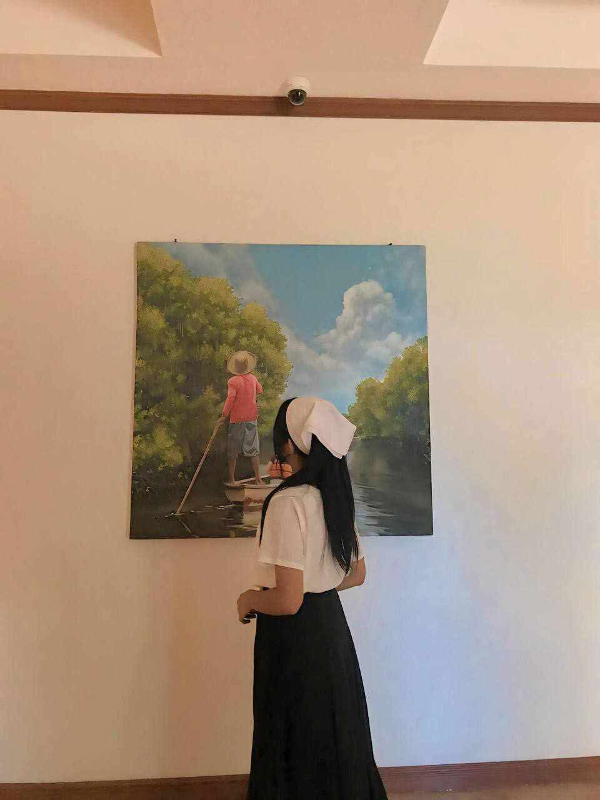

<!DOCTYPE html>
<html lang="en">
<head>
  <meta charset="UTF-8">
  <meta name="viewport" content="width=device-width, initial-scale=1.0">
  <title>E2 Computer Lab Exercises</title>
  
</head>
<body>
  

    <header>
      <h1>E2 COMPUTER LAB EXERCISES</h1>
      
By: Kiana Infante Bitara (2 - India)

      <audio controls>
        <source src="videoplayback (12).webm" type="audio/mp3">
        Your browser does not support the audio element.
      </audio>
      " alt="Kiana Infante Bitara">
    </header>
    <nav>
      <button onclick="navigate('autobiography')">Autobiography</button>
      <button onclick="navigate('article')">Article</button>
      <button onclick="navigate('blog')">Blog</button>
      <button onclick="navigate('form')">Form</button>
    </nav>
    <main id="content">
      <!-- Dynamic content will load here -->
    </main>
  

  
</body>
</html>
